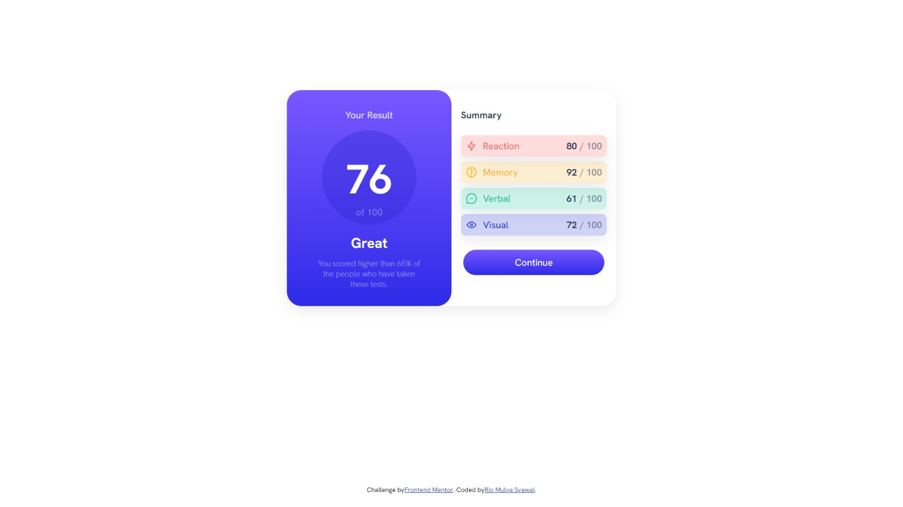

# summary-component

## Project setup

```
npm install
```

### Compiles and hot-reloads for development

```
npm run serve
```

### Compiles and minifies for production

```
npm run build
```

### Lints and fixes files

```
npm run lint
```

### Customize configuration

See [Configuration Reference](https://cli.vuejs.org/config/).

# Frontend Mentor - Results summary component solution

This is a solution to the [Results summary component challenge on Frontend Mentor](https://www.frontendmentor.io/challenges/results-summary-component-CE_K6s0maV). Frontend Mentor challenges help you improve your coding skills by building realistic projects.

## Table of contents

- [Overview](#overview)
  - [The challenge](#the-challenge)
  - [Screenshot](#screenshot)
  - [Links](#links)
- [My process](#my-process)
  - [Built with](#built-with)
  - [What I learned](#what-i-learned)
  - [Continued development](#continued-development)
- [Author](#author)

## Overview

### The challenge

Users should be able to:

- View the optimal layout for the interface depending on their device's screen size

### Screenshot




### Links

- Solution URL: [github](https://github.com/riomulya/Results-Summary-Component)
- Live Site URL: [Github Pages](https://riomulya.github.io/summary-cmp-rio.github.io/)

## My process

### Built with

- Semantic HTML5 markup
- Flexbox
- CSS Grid
- [Vue](https://vuejs.org/) - JS library

### What I learned

Use this section to recap over some of your major learnings while working through this project. Writing these out and providing code samples of areas you want to highlight is a great way to reinforce your own knowledge.

To see how you can add code snippets, see below:

## Basic Vue Component

````vue
<template>
  <div id="card">
    <the-result></the-result>
    <the-summary></the-summary>
  </div>
</template>

``` and script setup vue
<script setup>
import TheResult from '/src/components/TheResult.vue';
import TheSummary from '/src/components/TheSummary.vue';
</script>
````

```css media querry
@media (min-width: 320px) and (max-width: 767px) {
  /* Property */
}
```

### Continued development

-- I planned to use this component for future and modify it some.

## Author

- Frontend Mentor - [Rio Mulya S](https://www.frontendmentor.io/profile/riomulya)
